# Modelos de Machine Learning - Guía de Estudio

Este repositorio contiene ejemplos prácticos y didácticos de los algoritmos fundamentales de Machine Learning, con visualizaciones que te ayudarán a entender cómo funcionan. Cada script genera gráficas que se guardan en la carpeta `imgs/`.

---

## 📚 Tabla de Contenidos

1. [Regresión Lineal](#1-regresión-lineal)
2. [Clasificación con Regresión Logística](#2-clasificación-con-regresión-logística)
3. [Clasificación Multi-clase: Iris Dataset](#3-clasificación-multi-clase-iris-dataset)
4. [Clustering: Agrupamiento de Datos](#4-clustering-agrupamiento-de-datos)
5. [Competencia de Modelos de Regresión](#5-competencia-de-modelos-de-regresión)
6. [Competencia de Modelos de Clasificación](#6-competencia-de-modelos-de-clasificación)

---

## 1. Regresión Lineal

**Script:** `01_regresion_lineal.py`

### ¿Qué es la Regresión Lineal?

La regresión lineal es uno de los algoritmos más simples de machine learning. Su objetivo es encontrar una línea recta que mejor se ajuste a un conjunto de datos. Imagina que tienes puntos en una gráfica y quieres dibujar una línea que pase lo más cerca posible de todos ellos.

La ecuación de la línea recta es:

$$y = mx + b$$

Donde:
- $y$ es el valor que queremos predecir
- $x$ es el valor que conocemos
- $m$ es la pendiente (qué tan inclinada está la línea)
- $b$ es el intercepto (dónde cruza el eje Y)

### Visualizaciones Generadas

#### 1.1 Datos Sin Ruido - Scatter Plot
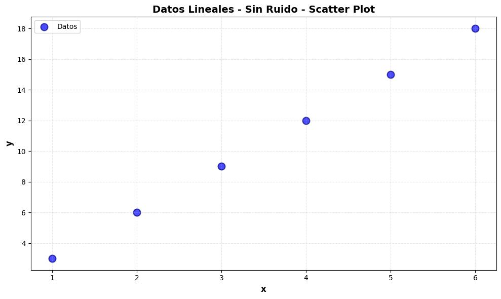

Esta gráfica muestra los datos originales en un scatter plot (gráfica de puntos). Cuando los datos no tienen ruido, los puntos forman un patrón muy claro y predecible. Es como conectar los puntos en un dibujo: es fácil ver por dónde debería pasar la línea.

#### 1.2 Datos Sin Ruido - Modelo Ajustado
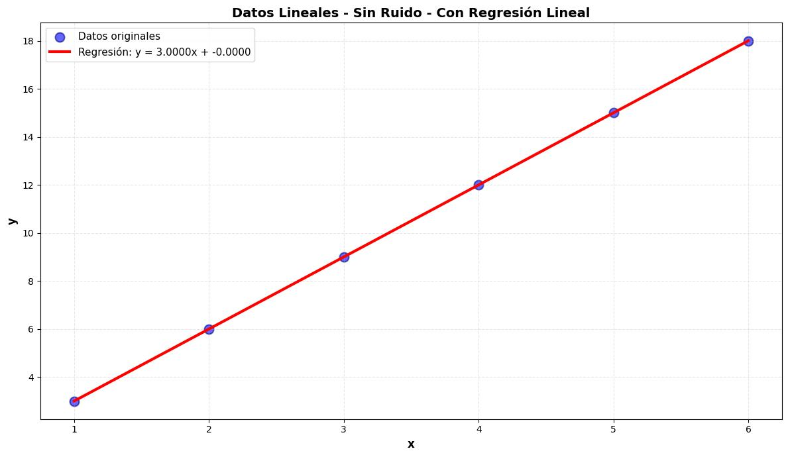

Aquí vemos la línea roja que el algoritmo encontró. Esta línea pasa casi perfectamente por todos los puntos porque los datos son muy limpios. El $R^2$ (R cuadrado) nos dice qué tan bien la línea explica los datos: un valor cercano a 1.0 significa que el ajuste es excelente.

#### 1.3 Datos Con Ruido - Scatter Plot
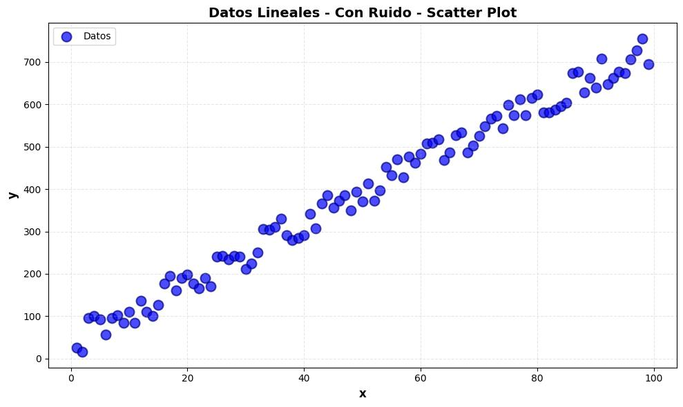

En la vida real, los datos nunca son perfectos. Esta gráfica muestra datos con "ruido": los puntos no están perfectamente alineados. Es como tomar mediciones en un experimento real donde siempre hay pequeños errores.

#### 1.4 Datos Con Ruido - Modelo Ajustado
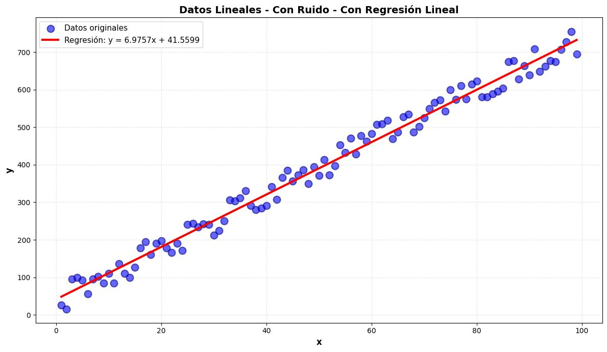

Incluso con ruido, el algoritmo puede encontrar una línea que captura la tendencia general. La línea roja no pasa exactamente por todos los puntos, pero representa el patrón promedio. Esto es normal y esperado cuando trabajamos con datos del mundo real.

### Conclusión

La regresión lineal es útil cuando queremos:
- Predecir un valor numérico (como precio, temperatura, etc.)
- Los datos muestran una relación aproximadamente lineal
- Necesitamos un modelo simple y fácil de interpretar

---

## 2. Clasificación con Regresión Logística

**Script:** `02_clasificacion.py`

### ¿Qué es la Clasificación?

A diferencia de la regresión (que predice números), la clasificación predice categorías. Por ejemplo: ¿es un email spam o no? ¿Un tumor es benigno o maligno? La regresión logística es un algoritmo que responde preguntas de "sí o no" (o más generalmente, preguntas con dos opciones).

La regresión logística usa la función sigmoide:

$$\sigma(x) = \frac{1}{1 + e^{-x}}$$

Esta función convierte cualquier número en un valor entre 0 y 1, que podemos interpretar como una probabilidad.

### Visualizaciones Generadas

#### 2.1 Exploración de Datos con Histogramas
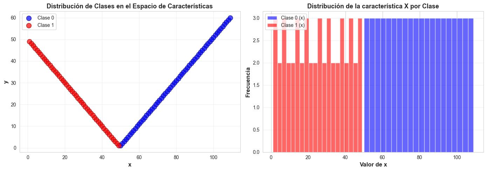

Esta gráfica combina tres elementos:
- **Centro**: Scatter plot mostrando dos clases de datos (clase 0 en azul, clase 1 en rojo)
- **Arriba**: Histograma de la variable X por clase
- **Derecha**: Histograma de la variable Y por clase

Los histogramas nos ayudan a ver si las dos clases se pueden separar fácilmente. Si los histogramas de cada color están muy mezclados, será difícil clasificar correctamente.

#### 2.2 Matriz de Confusión
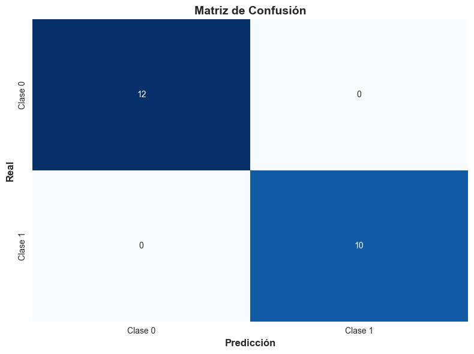

La matriz de confusión es como una tabla de calificaciones del modelo. Muestra:
- **Verdaderos Negativos (TN)**: Casos de clase 0 que predijimos correctamente como 0
- **Falsos Positivos (FP)**: Casos de clase 0 que incorrectamente predijimos como 1
- **Falsos Negativos (FN)**: Casos de clase 1 que incorrectamente predijimos como 0
- **Verdaderos Positivos (TP)**: Casos de clase 1 que predijimos correctamente como 1

Los números grandes en la diagonal (TN y TP) son buenos. Los números en las otras posiciones son errores.

#### 2.3 Curva ROC
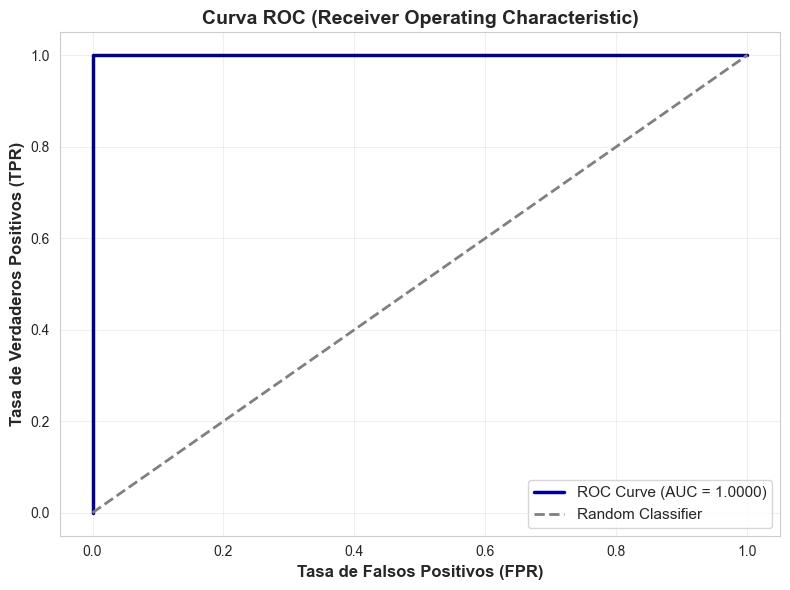

La curva ROC (Receiver Operating Characteristic) mide qué tan bien el modelo distingue entre las dos clases. 

- El área bajo la curva (AUC) va de 0 a 1
- AUC = 0.5 significa que el modelo es tan bueno como lanzar una moneda (aleatorio)
- AUC = 1.0 significa que el modelo es perfecto
- La línea diagonal punteada representa un clasificador aleatorio

Cuanto más se acerca la curva a la esquina superior izquierda, mejor es el modelo.

#### 2.4 Frontera de Decisión
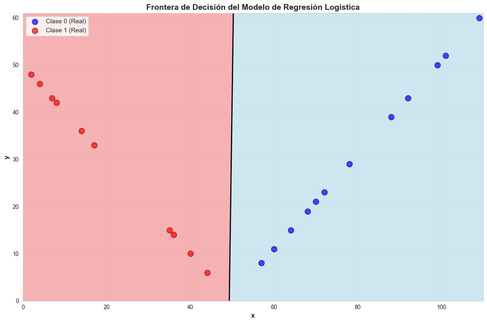

Esta es una de las visualizaciones más importantes. Muestra:
- Los puntos de datos reales (azules y rojos)
- Las regiones de color de fondo muestran qué clase predice el modelo en cada zona
- La línea que separa las regiones es la "frontera de decisión"

El modelo clasifica cualquier punto en la zona azul como clase 0, y cualquier punto en la zona roja como clase 1.

#### 2.5 Distribución de Probabilidades


Esta gráfica muestra las probabilidades que el modelo asigna a cada predicción:
- Histograma azul: probabilidades asignadas a casos de clase 0
- Histograma rojo: probabilidades asignadas a casos de clase 1
- Línea negra vertical: umbral de decisión (0.5)

Idealmente, las probabilidades de clase 0 deberían estar cerca de 0, y las de clase 1 cerca de 1. Si hay mucha superposición en el medio, significa que el modelo tiene incertidumbre.

### Conclusión

La regresión logística es ideal cuando:
- Necesitamos clasificar datos en dos categorías
- Queremos conocer la probabilidad de cada predicción
- Los datos son aproximadamente separables por una línea o curva suave

---

## 3. Clasificación Multi-clase: Iris Dataset

**Script:** `03_clasificacion_ejemplo.py`

### ¿Qué es la Clasificación Multi-clase?

En el ejemplo anterior vimos clasificación binaria (2 clases). Pero ¿qué pasa si tenemos 3 o más categorías? Por ejemplo, clasificar tipos de flores (setosa, versicolor, virginica) o reconocer dígitos escritos (0-9).

En este ejemplo usamos el famoso dataset Iris que contiene mediciones de 3 especies de flores. Comparamos dos algoritmos:
- **Regresión Logística**: Extiende la regresión logística binaria a múltiples clases
- **Random Forest**: Un conjunto de "árboles de decisión" que votan por la mejor respuesta

### Visualizaciones Generadas

#### 3.1 Distribución de Features por Clase
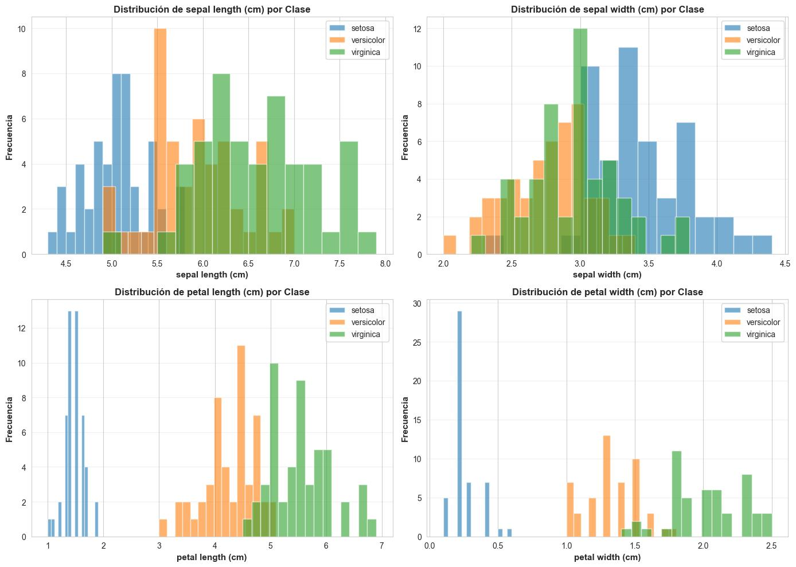

Estos 4 histogramas muestran cómo se distribuyen las 4 características medidas (largo y ancho de sépalo y pétalo) para cada especie de flor:
- Verde: Setosa
- Naranja: Versicolor  
- Azul: Virginica

Si los histogramas de cada color están bien separados para una característica, significa que esa característica es muy útil para distinguir las especies.

#### 3.2 Relaciones entre Características
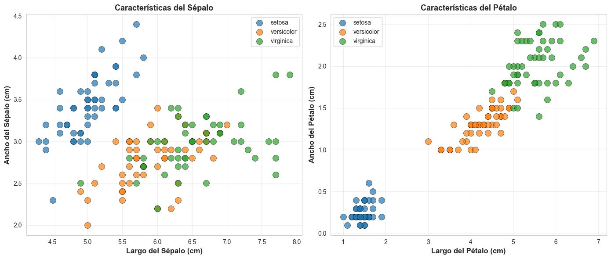

Estos scatter plots muestran cómo se relacionan las características entre sí:
- **Izquierda**: Relación entre largo y ancho del sépalo
- **Derecha**: Relación entre largo y ancho del pétalo

Podemos ver que las flores setosa son muy diferentes (puntos verdes separados), mientras que versicolor y virginica se parecen más.

#### 3.3 Matriz de Correlación
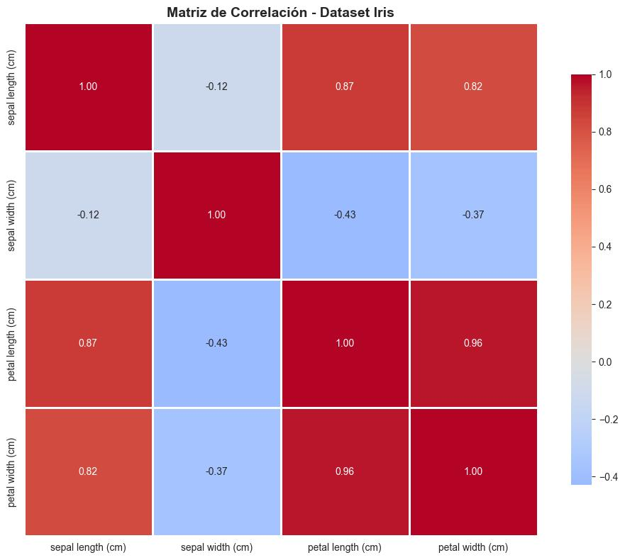

Esta matriz muestra qué tan relacionadas están las características entre sí:
- Valores cercanos a 1 (rojo): fuertemente correlacionadas (cuando una sube, la otra también)
- Valores cercanos a -1 (azul): correlación negativa (cuando una sube, la otra baja)
- Valores cercanos a 0 (blanco): no hay relación clara

Por ejemplo, el largo y ancho del pétalo están muy correlacionados (0.96), lo que significa que flores con pétalos largos también tienden a tener pétalos anchos.

#### 3.4 Comparación de Modelos: Matrices y Métricas
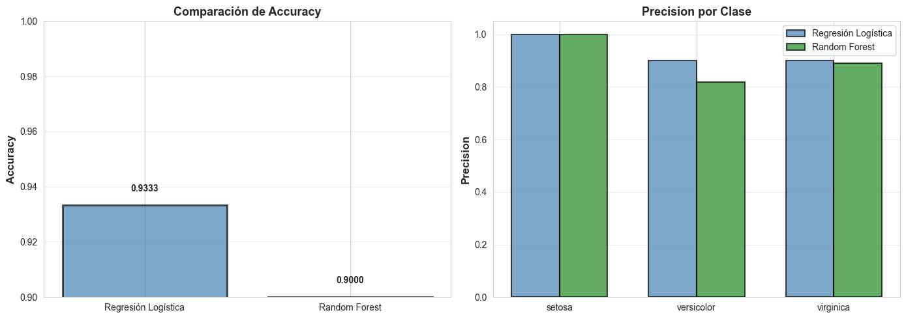

Esta visualización compara los dos algoritmos:
- **Arriba izquierda**: Accuracy general de cada modelo
- **Arriba derecha**: Precision por cada especie

Podemos ver que Random Forest generalmente obtiene mejores resultados que Regresión Logística en este problema. La precision nos dice: de todas las veces que el modelo dijo "es una setosa", ¿cuántas veces tuvo razón?

### Conclusión

Para clasificación multi-clase:
- Algoritmos más complejos (Random Forest) suelen ser más precisos
- Es importante analizar el rendimiento en cada clase, no solo el promedio
- Visualizar los datos ayuda a entender qué características son más importantes

---

## 4. Clustering: Agrupamiento de Datos

**Script:** `04_clusterizacion.py`

### ¿Qué es el Clustering?

El clustering es diferente a la clasificación: no tenemos etiquetas previas. Es como si te dieran un montón de objetos mezclados y te pidieran agruparlos sin decirte los criterios. El algoritmo encuentra patrones por sí mismo y agrupa datos similares.

Probamos tres algoritmos:
- **K-Means**: Divide los datos en K grupos circulares
- **Agglomerative Clustering**: Va uniendo puntos cercanos paso a paso
- **DBSCAN**: Encuentra grupos de cualquier forma basándose en densidad

### Visualizaciones Generadas

#### 4.1 Distribución de Características por Especie
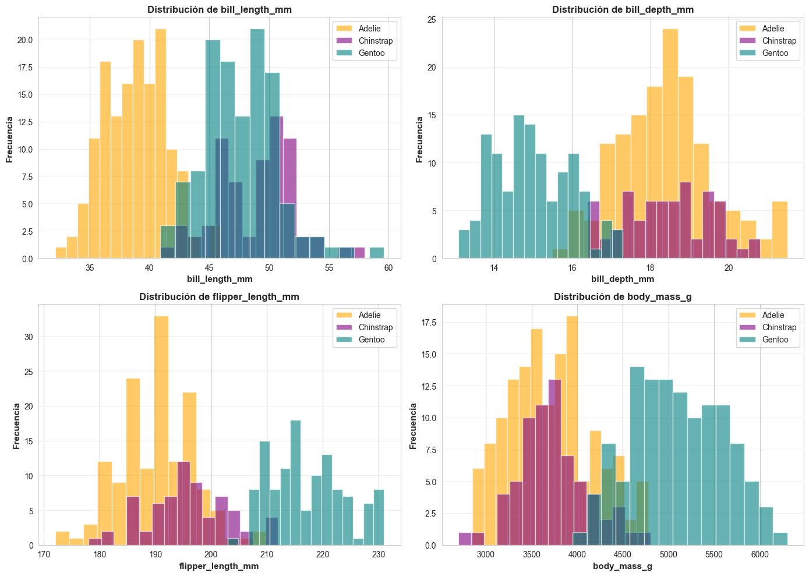

Aunque estamos haciendo clustering (sin etiquetas), estos histogramas muestran las especies reales de pingüinos para que podamos evaluar después si el clustering las descubrió correctamente. Vemos 4 características físicas de los pingüinos: longitud del pico, profundidad del pico, largo de aleta y masa corporal.

#### 4.2 Relaciones entre Características Físicas
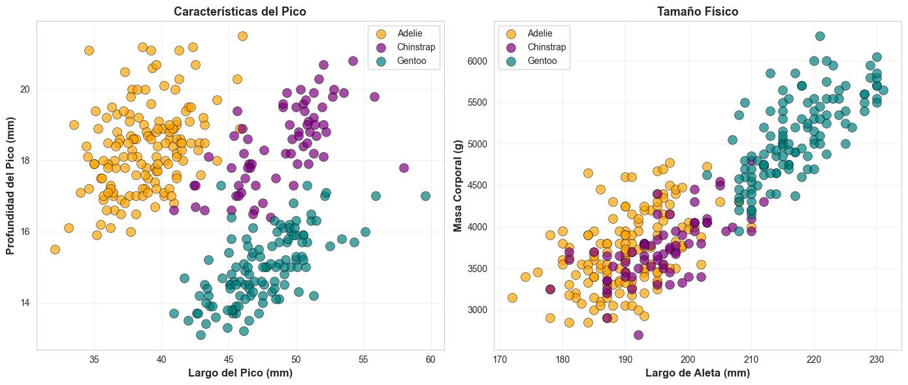

Estos scatter plots muestran:
- **Izquierda**: Dimensiones del pico
- **Derecha**: Tamaño físico general

Los tres colores representan las tres especies reales. Podemos ver que los pingüinos Adelie (naranjas) son bastante diferentes de los otros dos, lo que sugiere que el clustering debería poder identificarlos fácilmente.

#### 4.3 Matriz de Correlación
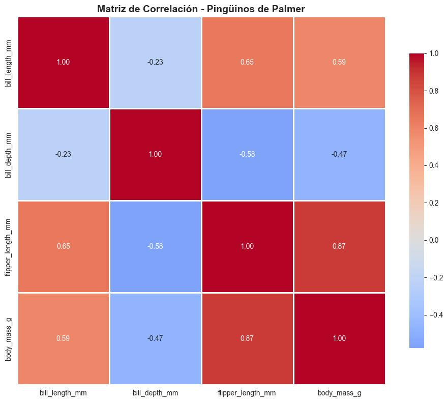

Similar al ejemplo anterior, esta matriz muestra qué características están relacionadas. Por ejemplo, la masa corporal está fuertemente correlacionada con el largo de la aleta (0.87), lo que tiene sentido: pingüinos más grandes tienden a tener aletas más grandes.

#### 4.4 Método del Codo
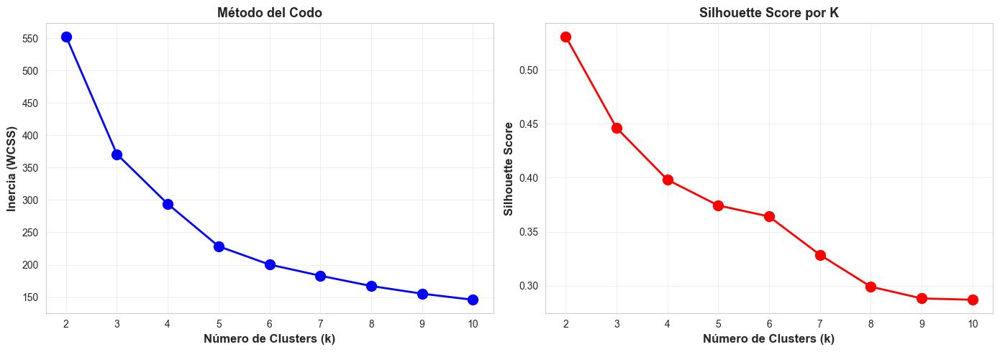

¿Cuántos grupos deberíamos buscar? Estas dos gráficas nos ayudan a decidir:

- **Izquierda (Inercia)**: Mide qué tan compactos son los grupos. Queremos encontrar el "codo" donde la curva deja de mejorar dramáticamente.
- **Derecha (Silhouette Score)**: Mide qué tan bien separados están los grupos (valores cercanos a 1 son mejores).

En este caso, k=3 parece ser óptimo, ¡que casualmente coincide con las 3 especies reales!

#### 4.5 Visualización de Clusters en 2D (PCA)
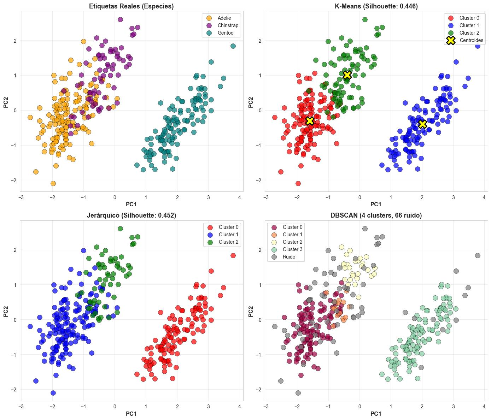

Para visualizar los datos en 2D, usamos PCA (Análisis de Componentes Principales), que es como tomar una foto de los datos desde el mejor ángulo posible. Estas 4 gráficas muestran:

- **Arriba izquierda**: Las especies reales
- **Arriba derecha**: Grupos encontrados por K-Means
- **Abajo izquierda**: Grupos encontrados por Clustering Jerárquico
- **Abajo derecha**: Grupos encontrados por DBSCAN

Comparando con las especies reales, podemos ver qué algoritmo funcionó mejor. K-Means y Jerárquico lograron una separación muy similar a la real.

#### 4.6 Comparación de Algoritmos
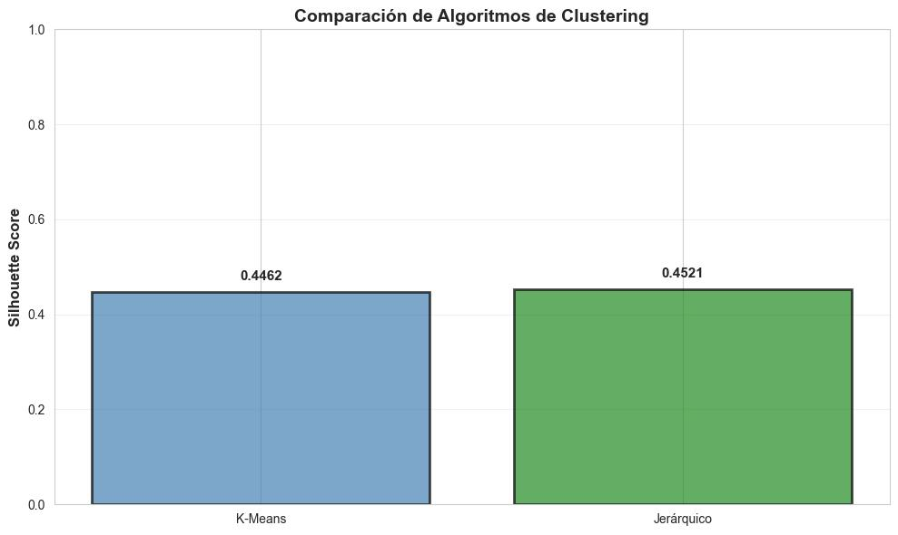

Esta gráfica compara directamente los algoritmos usando el Silhouette Score. Un valor más alto significa mejor separación entre grupos. Vemos que K-Means y Clustering Jerárquico obtuvieron resultados similares y buenos.

### Conclusión

El clustering es útil cuando:
- No tenemos etiquetas en nuestros datos
- Queremos descubrir patrones ocultos o segmentos naturales
- Necesitamos agrupar clientes, documentos, imágenes, etc.

---

## 5. Competencia de Modelos de Regresión

**Script:** `05_competencia_modelos_regresion.py`

### ¿Por qué comparar modelos?

No existe un modelo perfecto para todos los problemas. Cada algoritmo tiene fortalezas y debilidades. En este script probamos 11 modelos diferentes de regresión para predecir precios de viviendas en California y vemos cuál funciona mejor.

Los modelos comparados incluyen:
- Modelos lineales: Linear Regression, Ridge, Lasso, ElasticNet
- Modelos basados en árboles: Decision Tree, Random Forest, Gradient Boosting, AdaBoost, XGBoost
- Otros: KNN, SVR

### Métricas de Evaluación

Usamos dos métricas principales:
- **R² (R-cuadrado)**: Va de 0 a 1. Valores cercanos a 1 significan que el modelo explica muy bien los datos.
- **RMSE (Error Cuadrático Medio)**: El error promedio de las predicciones. Valores más bajos son mejores.

### Visualizaciones Generadas

#### 5.1 Distribución de la Variable Objetivo
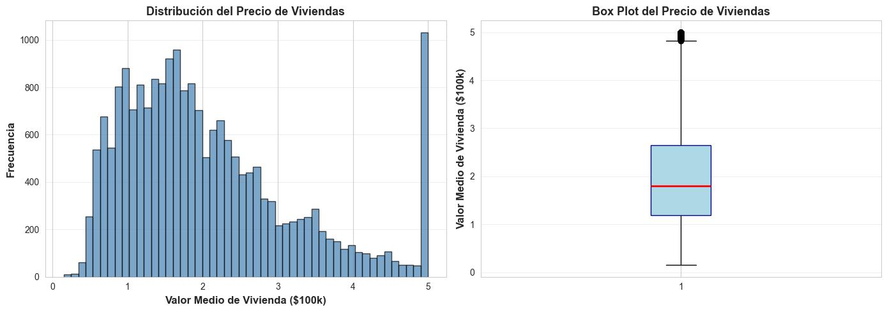

Estas gráficas muestran la distribución de los precios de las viviendas:
- **Izquierda (Histograma)**: La mayoría de las casas cuestan entre $1-3 (en unidades de $100,000)
- **Derecha (Box Plot)**: Muestra la mediana, cuartiles y valores atípicos

Podemos ver que hay algunas casas muy caras (outliers), pero la mayoría están en un rango más moderado.

#### 5.2 Distribución de Características


Cuatro características importantes:
- **MedInc**: Ingreso medio de la zona
- **HouseAge**: Edad promedio de las casas
- **AveRooms**: Número promedio de habitaciones
- **Population**: Población de la zona

Cada una tiene una distribución diferente que el modelo debe aprender a usar para predecir precios.

#### 5.3 Relación entre Características y Precio
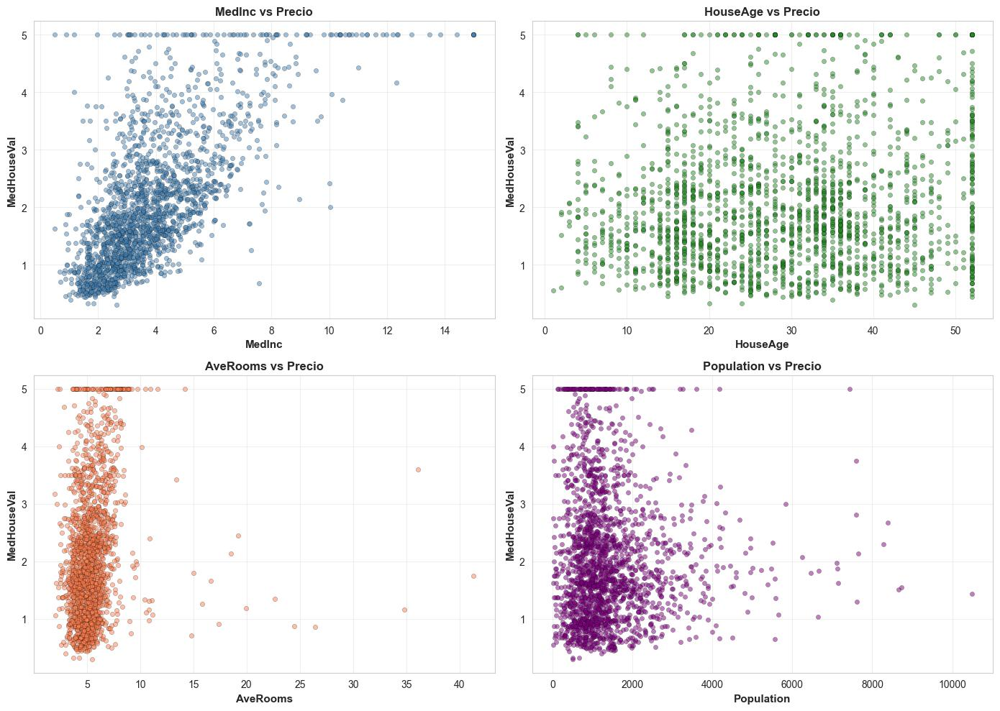

Estos scatter plots muestran cómo cada característica se relaciona con el precio:
- **MedInc** muestra una relación clara: mayor ingreso → mayor precio
- Las otras características muestran patrones más complejos

Estas visualizaciones nos ayudan a entender qué características son más predictivas.

#### 5.4 Matriz de Correlación
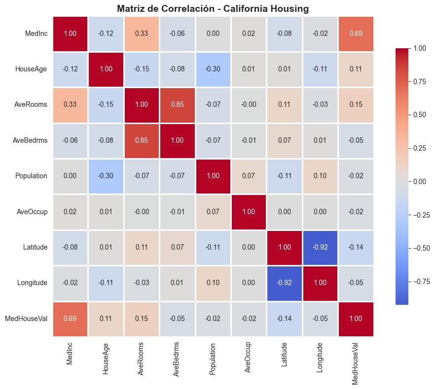

Esta matriz muestra todas las relaciones entre variables. Lo más importante es la última columna/fila (MedHouseVal), que muestra qué características están más correlacionadas con el precio. MedInc (ingreso medio) tiene la correlación más fuerte (0.69).

#### 5.5 Mapa Geográfico de Precios
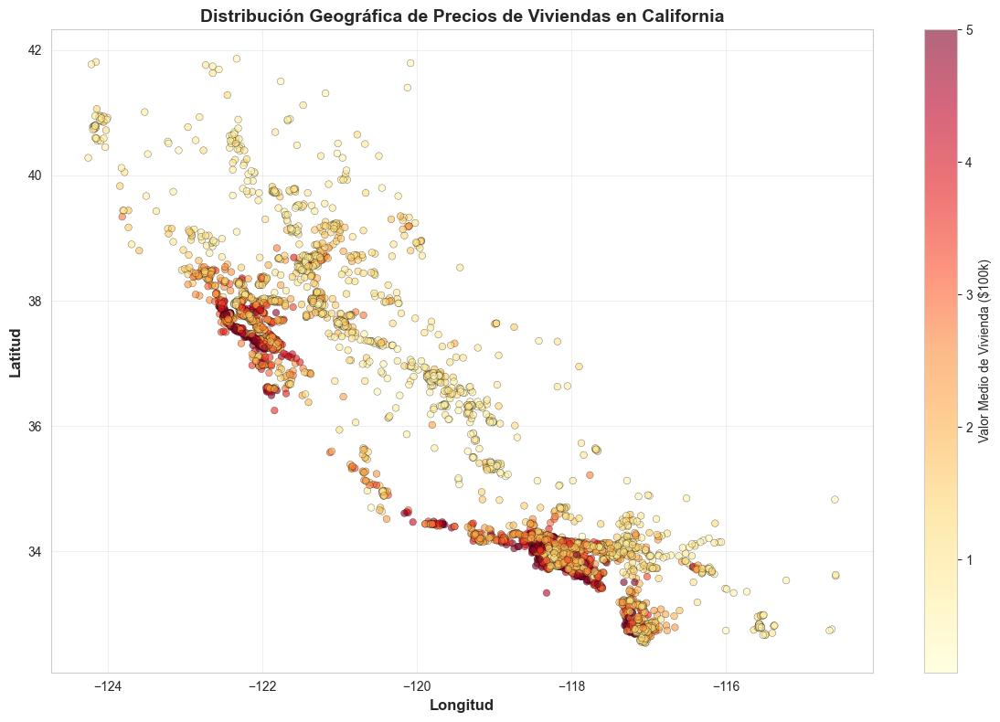

Esta es una visualización especial: cada punto es una ubicación en California, y el color representa el precio. Podemos ver claramente que:
- Las zonas costeras (especialmente cerca de San Francisco y Los Ángeles) son más caras (colores cálidos)
- Las zonas del interior son más baratas (colores fríos)

¡La ubicación geográfica es muy importante para el precio!

#### 5.6 Comparación de Métricas entre Modelos
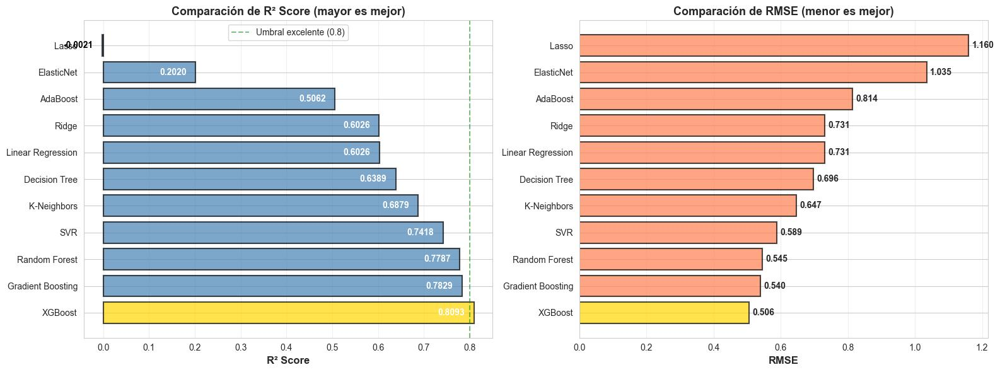

Dos gráficas de barras que comparan todos los modelos:
- **Arriba**: R² Score (mayor es mejor) - el modelo ganador está en dorado
- **Abajo**: RMSE (menor es mejor) - el modelo ganador está en dorado

Podemos ver rápidamente qué modelos funcionaron mejor. Los modelos de ensemble (Gradient Boosting, Random Forest) suelen estar en el top.

#### 5.7 Dispersión R² vs RMSE
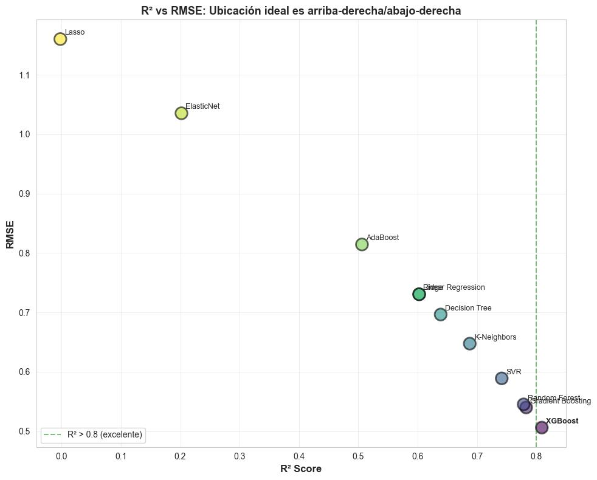

Esta gráfica muestra ambas métricas simultáneamente. Cada punto es un modelo. El modelo ideal estaría en la esquina superior derecha (alto R², bajo RMSE). Los modelos marcados en rojo están en la "zona excelente" (R² > 0.8).

#### 5.8 Análisis de Residuos del Mejor Modelo
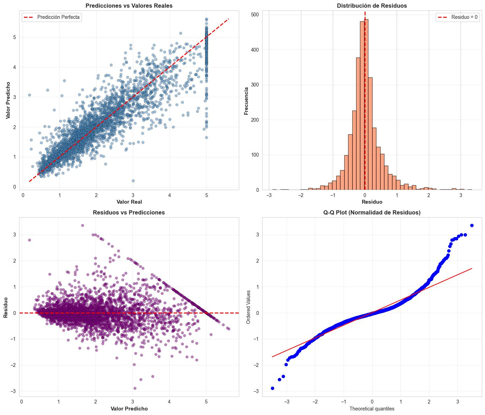

Un análisis profundo del mejor modelo a través de 4 gráficas:

1. **Predicciones vs Valores Reales**: Los puntos deberían estar cerca de la línea roja diagonal. Cuanto más dispersos, peor es el modelo.

2. **Distribución de Residuos**: Los residuos (errores) deberían formar una campana centrada en 0. Esto significa que el modelo no tiene sesgo sistemático.

3. **Residuos vs Predicciones**: No debería haber patrones claros. Si hay un patrón (como un embudo), significa que el modelo funciona mejor en ciertos rangos de precio.

4. **Q-Q Plot**: Los puntos deberían estar sobre la línea diagonal. Esto verifica si los residuos siguen una distribución normal.

#### 5.9 Importancia de Características
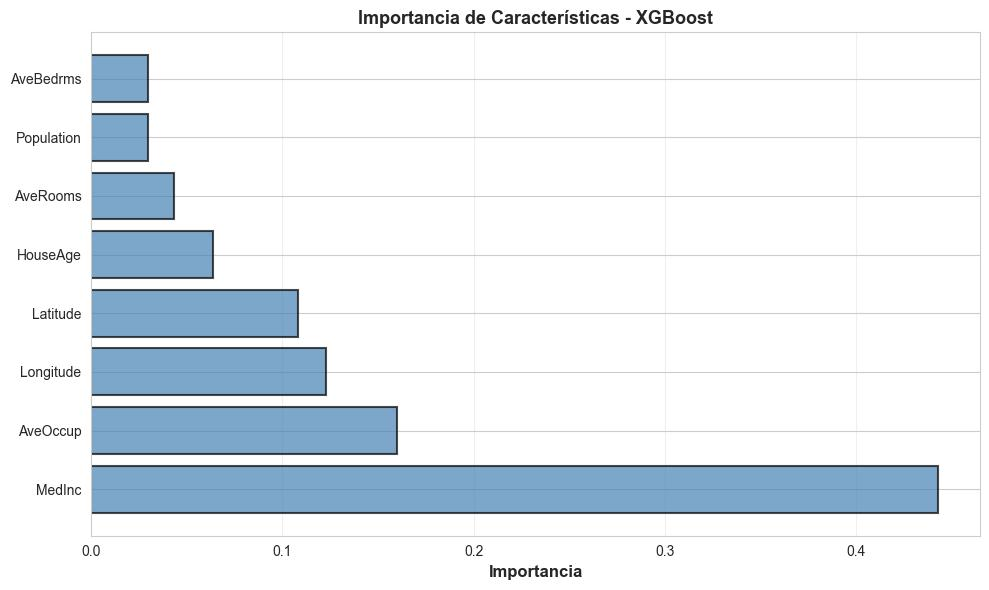

Esta gráfica muestra qué características son más importantes para el mejor modelo. Por ejemplo, si el mejor modelo es Random Forest o Gradient Boosting, podemos ver que MedInc (ingreso medio) es típicamente la característica más importante, seguida de ubicación (Latitude, Longitude).

### Conclusión

Este análisis nos enseña que:
- Diferentes modelos tienen diferentes fortalezas
- Los modelos de ensemble (que combinan múltiples modelos) suelen funcionar mejor
- Es importante no solo mirar la precisión, sino también analizar los errores
- La importancia de características nos ayuda a entender qué factores impulsan las predicciones

---

## 6. Competencia de Modelos de Clasificación

**Script:** `06_competencia_modelos_clasificacion.py`

### Competencia para Clasificación Binaria

Similar al script anterior, pero para clasificación. Usamos el dataset de Cáncer de Mama de Wisconsin para predecir si un tumor es benigno o maligno. Probamos 8 modelos diferentes:

- Regresión Logística
- K-Nearest Neighbors (KNN)
- Decision Tree
- Random Forest
- Support Vector Machine (SVM)
- Gaussian Naive Bayes
- Gradient Boosting
- AdaBoost

### Métricas de Evaluación

Para clasificación usamos:
- **Accuracy**: % de predicciones correctas
- **Precision**: De los casos que predijimos como positivos, ¿cuántos realmente lo eran?
- **Recall**: De todos los casos positivos reales, ¿cuántos detectamos?
- **F1-Score**: Promedio armónico de Precision y Recall
- **ROC-AUC**: Área bajo la curva ROC

### Visualizaciones Generadas

#### 6.1 Exploración de Datos
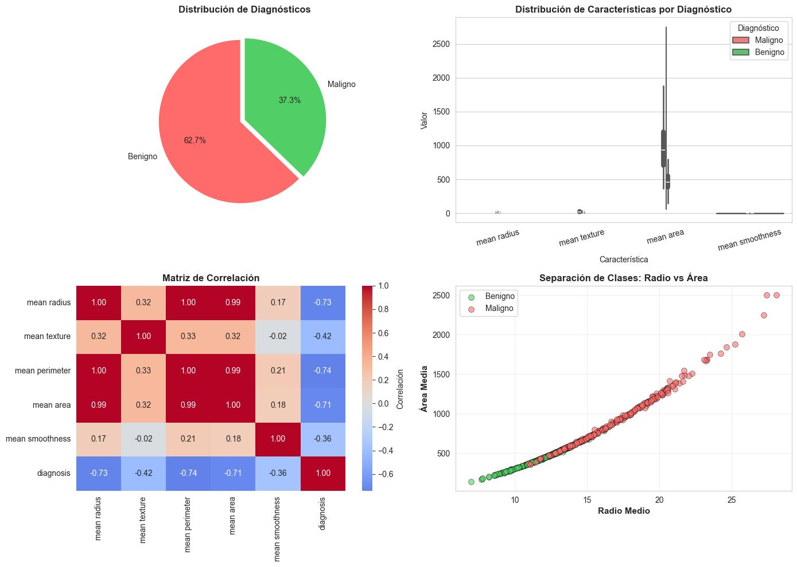

Cuatro visualizaciones exploratorias:
1. **Arriba izquierda (Pie Chart)**: Proporción de tumores benignos vs malignos en el dataset
2. **Arriba derecha (Violin Plot)**: Distribución de la feature más importante por clase. El "violín" muestra la densidad de los datos.
3. **Abajo izquierda (Heatmap)**: Correlación entre las primeras características
4. **Abajo derecha (Scatter)**: Relación entre dos características importantes, coloreadas por clase

#### 6.2 Comparación de Métricas entre Modelos
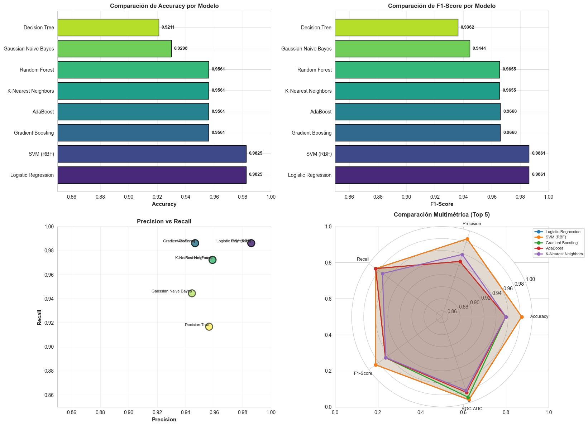

Cuatro visualizaciones que comparan los modelos:
1. **Arriba izquierda**: Accuracy de cada modelo
2. **Arriba derecha**: F1-Score de cada modelo
3. **Abajo izquierda**: Precision vs Recall (cada punto es un modelo)
4. **Abajo derecha**: Gráfica de radar comparando los top 3 modelos en múltiples métricas simultáneamente

La gráfica de radar es especialmente útil porque muestra el perfil completo de cada modelo de un vistazo.

#### 6.3 Análisis Detallado del Mejor Modelo
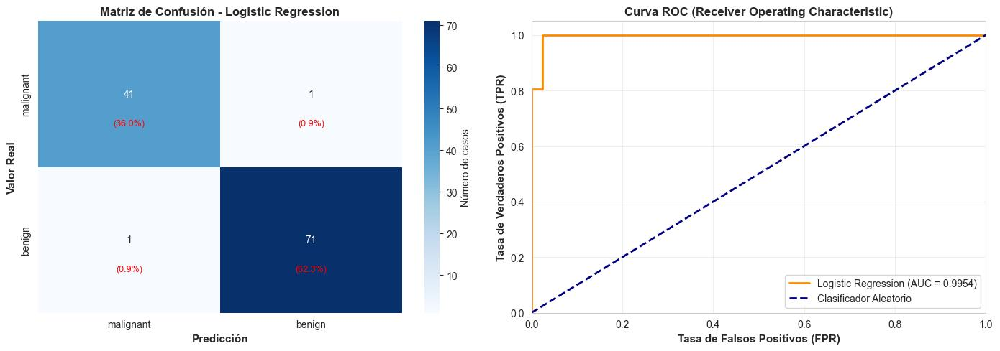

Dos visualizaciones del modelo ganador:
- **Izquierda**: Matriz de confusión con porcentajes. Muestra exactamente cuántos casos clasificó bien y mal.
- **Derecha**: Curva ROC específica de este modelo

Esta visualización nos da confianza en el modelo ganador al ver su desempeño detallado.

#### 6.4 Curvas ROC de Todos los Modelos
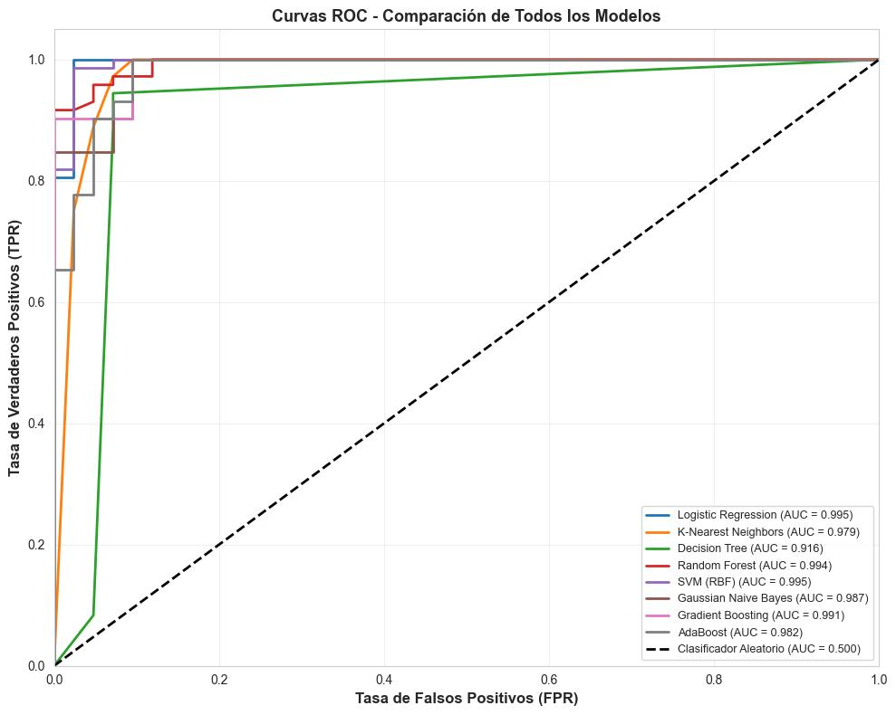

Todas las curvas ROC superpuestas en una sola gráfica. Esto permite comparar visualmente todos los modelos. Las curvas que están más cerca de la esquina superior izquierda son mejores. Podemos ver que la mayoría de los modelos funcionan muy bien (AUC > 0.95), lo que significa que este problema es relativamente "fácil" para machine learning.

#### 6.5 Importancia de Características
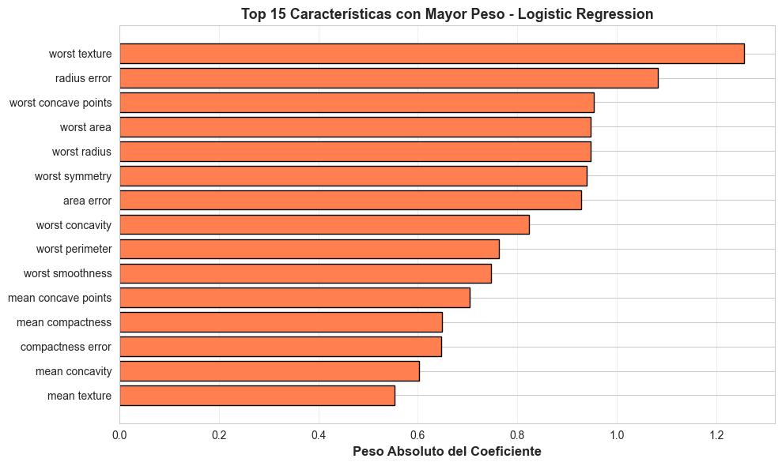

Muestra las 15 características más importantes para el mejor modelo. Esto nos dice qué mediciones del tumor son más útiles para distinguir entre benigno y maligno. Por ejemplo, características como "worst perimeter" (perímetro peor) y "worst area" (área peor) suelen ser muy predictivas.

### Conclusión

Este análisis demuestra que:
- Para problemas médicos críticos, queremos modelos con muy alta precision (evitar falsos positivos) y recall (no perder casos positivos)
- Múltiples modelos pueden lograr excelente desempeño en el mismo problema
- La curva ROC nos ayuda a seleccionar el umbral óptimo según nuestras prioridades (¿es peor un falso positivo o un falso negativo?)
- La importancia de características puede validarse con conocimiento médico experto

---

## 🎯 Resumen General

Este repositorio te lleva en un viaje desde los conceptos más básicos (regresión lineal simple) hasta técnicas avanzadas (competencias de modelos con validación cruzada). Cada ejemplo incluye:

✅ Código bien documentado
✅ Visualizaciones claras y didácticas  
✅ Explicaciones en lenguaje simple
✅ Métricas de evaluación apropiadas
✅ Comparaciones entre diferentes enfoques

## 📦 Requisitos

Para ejecutar los scripts necesitas instalar:
```bash
pip install pandas numpy matplotlib seaborn scikit-learn xgboost scipy
```

## 🚀 Cómo Usar

1. Ejecuta cada script de Python en orden (01, 02, 03...)
2. Las gráficas se guardarán automáticamente en `imgs/`
3. También se mostrarán en pantalla durante la ejecución
4. Lee este README junto con las visualizaciones para entender cada concepto

## 📚 Recursos para Aprender Más

- Documentación de scikit-learn: https://scikit-learn.org/
- Curso de Machine Learning de Andrew Ng (Coursera)
- "Introduction to Statistical Learning" (libro gratuito en PDF)

---

**¡Feliz aprendizaje! 🎓**

